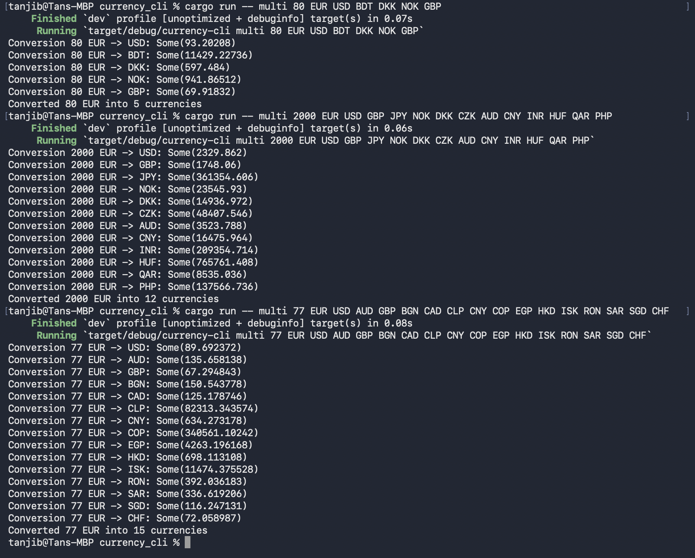

# Currency CLI 💱

## Problem
Converting currencies manually is slow and error-prone.

## Solution
Currency CLI automates conversions with:
- Multi-currency support
- Historical rates
- Fast caching
- Easy CLI usage

## Demo

## Download
- [Linux aarch64 binary](link-to-artifact)
- [Linux x86_64 binary](link-to-artifact)

## Pricing
Free for students. Future premium features planned.
